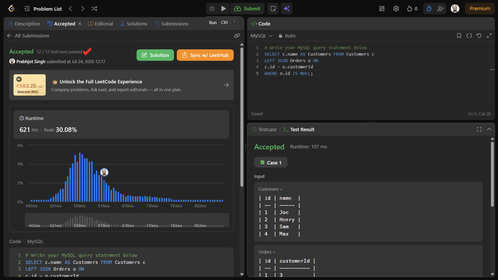

(Experiment 3 - Task 3)

Name: Prabhjot Singh

UID: 24BCS10293

## Aim

To find all customers who never placed any order.

## Question

Write a solution to find all customers who never order anything.

## SQL Queries Used

```sql
SELECT c.name AS Customers
FROM Customers c
LEFT JOIN Orders o
    ON c.id = o.customerId
WHERE o.customerId IS NULL;
```

## Output

```text
+-----------+
| Customers |
+-----------+
| Henry     |
| Max       |
+-----------+
```

## Output Screenshot



## Image Explanation

The query finds customers whose IDs do not appear in the `Orders` table.

## Result

The SQL query returns the names of customers who have never placed an order.

