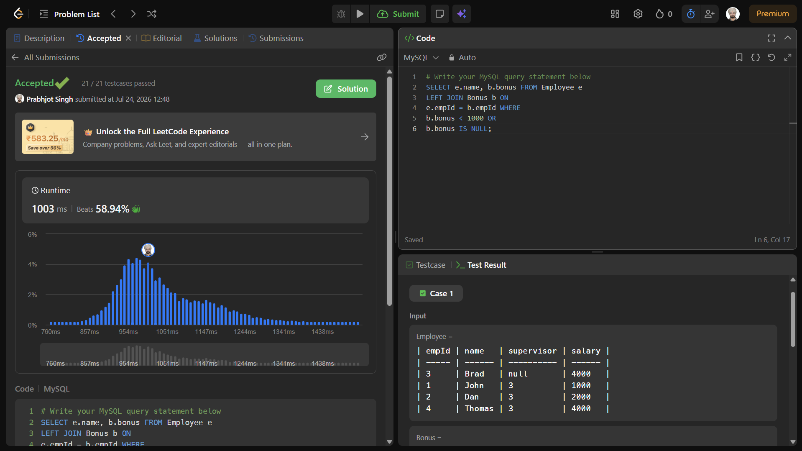

# Experiment 3 - Task 4

Name: Prabhjot Singh

UID: 24BCS10293

## Aim

To report the name and bonus amount of each employee who has a bonus less than 1000 or did not receive any bonus.

## Question

Write a solution to report the name and bonus amount of each employee who satisfies either of the following:

- The employee has a bonus less than `1000`.
- The employee did not get any bonus.

The result should return the employee name and bonus amount in any order.

Table: `Employee`

- `empId`
- `name`
- `supervisor`
- `salary`

Table: `Bonus`

- `empId`
- `bonus`

## SQL Queries Used

```sql
SELECT e.name, b.bonus
FROM Employee e
LEFT JOIN Bonus b
    ON e.empId = b.empId
WHERE b.bonus < 1000 OR b.bonus IS NULL;
```

## Output

```text
+------+-------+
| name | bonus |
+------+-------+
| Brad | null  |
| John | null  |
| Dan  | 500   |
+------+-------+
```

## Output Screenshot



## Image Explanation

The query uses a `LEFT JOIN` to keep all employees, then filters rows where the bonus is below `1000` or missing, which includes employees with no matching record in the `Bonus` table.

## Result

The SQL query returns the employees who qualify under the bonus filter conditions along with their bonus values.
