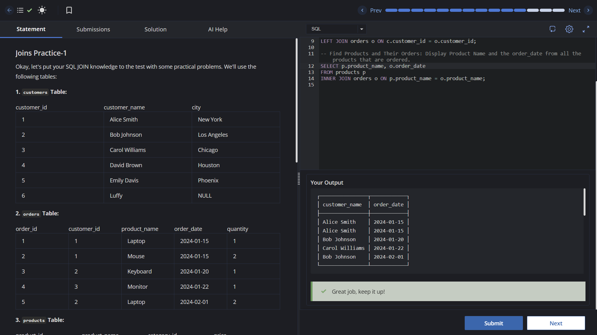

# Experiment 4 - Task 1

Name: Prabhjot Singh

UID: 24BCS10293

## Aim

To practice SQL JOIN operations across `customers`, `orders`, and `products` tables.

## Question

Write SQL queries to:

- list customer names with their order dates,
- list all customers with their ordered products (including customers with no orders),
- display product names with the order dates for ordered products.

## SQL Queries Used

### Customers and their order dates (INNER JOIN)

```sql
SELECT c.customer_name, o.order_date
FROM customers c
INNER JOIN orders o ON c.customer_id = o.customer_id;
```

### All customers and their ordered products (LEFT JOIN)

```sql
SELECT c.customer_name, o.product_name
FROM customers c
LEFT JOIN orders o ON c.customer_id = o.customer_id;
```

### Ordered products with order dates (INNER JOIN)

```sql
SELECT p.product_name, o.order_date
FROM products p
INNER JOIN orders o ON p.product_name = o.product_name;
```

## Output

```text
The queries return:
1) customer names with matching order dates,
2) all customers with product names (NULL where no order exists),
3) ordered product names with corresponding order dates.
```

## Output Screenshot



## Image Explanation

The screenshot shows successful JOIN execution and a result set containing `customer_name` and `order_date` for customers who placed orders.

## Result

The JOIN queries were executed successfully and produced the required customer, product, and order mapping results.
