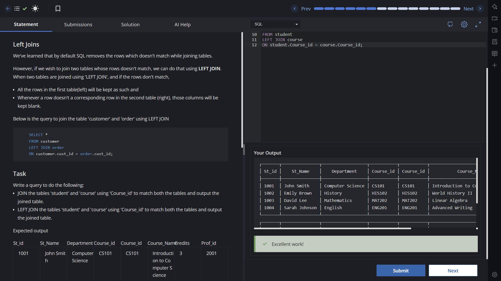

# Experiment 4 - Task 2

Name: Prabhjot Singh

UID: 24BCS10293

## Aim

To understand and compare `JOIN` and `LEFT JOIN` on `student` and `course` tables.

## Question

Write SQL queries to:

- `JOIN` the `student` and `course` tables using `Course_id`,
- `LEFT JOIN` the `student` and `course` tables using `Course_id`.

## SQL Queries Used

### INNER JOIN on `Course_id`

```sql
SELECT *
FROM student
JOIN course
ON student.Course_id = course.Course_id;
```

### LEFT JOIN on `Course_id`

```sql
SELECT *
FROM student
LEFT JOIN course
ON student.Course_id = course.Course_id;
```

## Output

```text
The INNER JOIN returns only rows where Course_id exists in both tables.
The LEFT JOIN returns all student rows and matching course rows, with NULLs for unmatched course data.
```

## Output Screenshot



## Image Explanation

The screenshot displays joined columns from both tables, including student details and corresponding course details based on `Course_id`.

## Result

Both `JOIN` and `LEFT JOIN` queries execute correctly and demonstrate matched vs. inclusive join behavior.
