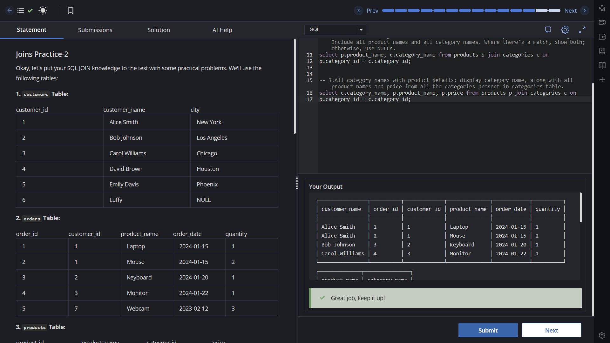

# Experiment 4 - Task 3

Name: Prabhjot Singh

UID: 24BCS10293

## Aim

To perform multiple JOIN-based queries involving customers, orders, products, and categories.

## Question

Write SQL queries to:

- get all orders with their customer details,
- combine product names with category names,
- display category names with product names and prices.

## SQL Queries Used

### Orders with customer details

```sql
select
c.customer_name,
o.order_id,
c.customer_id,
o.product_name,
o.order_date,
o.quantity from customers c join orders o on c.customer_id = o.customer_id;
```

### Products with categories

```sql
select p.product_name, c.category_name from products p join categories c on
p.category_id = c.category_id;
```

### Category-wise product details

```sql
select c.category_name, p.product_name, p.price from products p join categories c on
p.category_id = c.category_id;
```

## Output

```text
The queries return:
1) customer-order details for matching customer IDs,
2) product and category name pairs for matching category IDs,
3) category names with associated product names and prices.
```

## Output Screenshot



## Image Explanation

The screenshot shows successful execution of JOIN queries, including rows with `customer_name`, `order_id`, `product_name`, `order_date`, and `quantity` for matched records.

## Result

All three JOIN queries execute successfully and provide the required combined table outputs.
