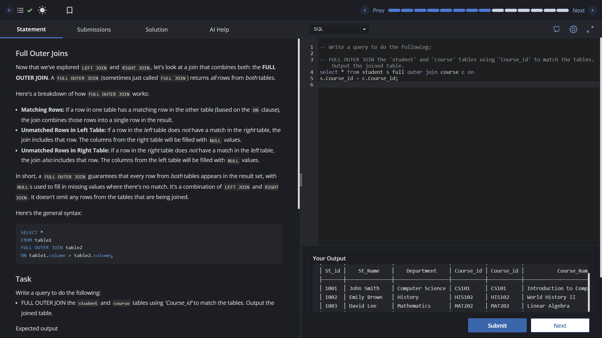

# Experiment 4 - Task 4

Name: Prabhjot Singh

UID: 24BCS10293

## Aim

To apply `FULL OUTER JOIN` and understand how unmatched rows from both tables are included.

## Question

Write a query to perform a `FULL OUTER JOIN` between `student` and `course` tables using `Course_id`.

## SQL Queries Used

### FULL OUTER JOIN on `Course_id`

```sql
select * from student s full outer join course c on
s.Course_id = c.Course_id;
```

## Output

```text
The query returns all rows from both `student` and `course` tables.
For unmatched rows, columns from the opposite table are shown as NULL.
```

## Output Screenshot



## Image Explanation

The screenshot shows a combined result where matching `Course_id` values merge into single rows, while non-matching entries are still preserved through `FULL OUTER JOIN`.

## Result

The `FULL OUTER JOIN` query executes successfully and demonstrates inclusion of both matched and unmatched rows from both tables.
