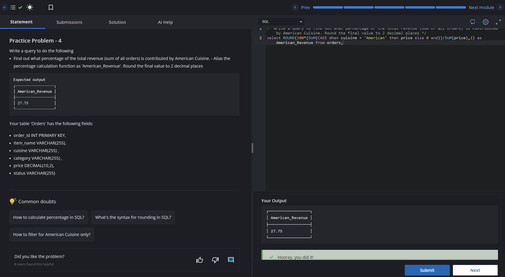

# Experiment 5 - Task 1

Name: Prabhjot Singh

UID: 24BCS10293

## Aim

To calculate the proportion of total revenue contributed by American Cuisine.

## Question

Write a query to find what percentage of the total revenue comes from American Cuisine and round the result to two decimal places.

## SQL Queries Used

```sql
select ROUND(100*(SUM(CASE When cuisine = 'American' then price else 0 end))/SUM(price),2) as American_Revenue from orders;
```

## Output

```text
The query returns the American Cuisine revenue as a percentage of the total order revenue.
```

## Output Screenshot



## Image Explanation

The screenshot shows the SQL query result for the revenue percentage calculation, where the American Cuisine contribution is computed from the total revenue.

## Result

The revenue percentage for American Cuisine was calculated successfully and rounded to two decimal places.