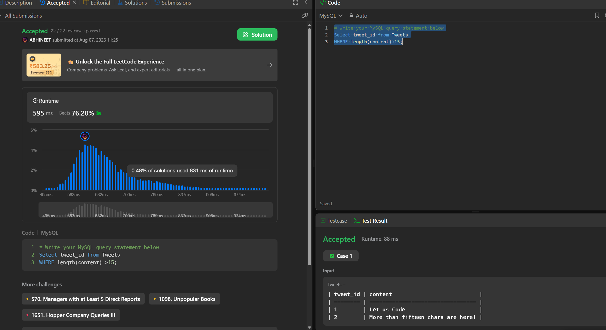

# Experiment 5 - Task 3

Name: Prabhjot Singh

UID: 24BCS10293

## Aim

To retrieve tweet IDs whose content length is greater than 15 characters.

## Question

Write a MySQL query to select the tweet_id values from the Tweets table where the content length is greater than 15.

## SQL Queries Used

```sql
# Write your MySQL query statement below
Select tweet_id from Tweets
WHERE length(content)>15;
```

## Output

```text
The query returns the tweet IDs whose content length exceeds 15 characters.
```

## Output Screenshot



## Image Explanation

The screenshot shows the SQL query execution result, where tweet IDs are returned based on the content-length condition.

## Result

The required tweet IDs were retrieved successfully using the given condition.