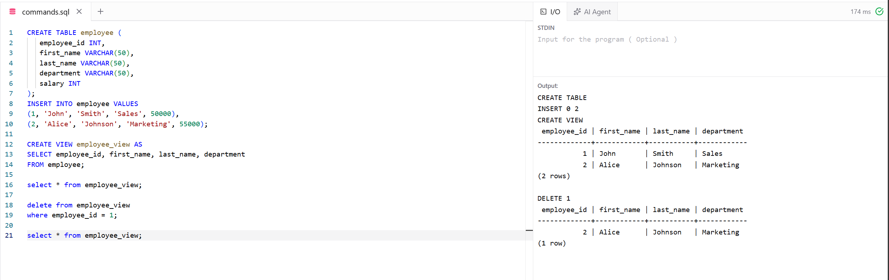

# Experiment 6 - Task 1

Name: Prabhjot Singh

UID: 24BCS10293

## Aim

To create a view containing selected employee details and delete a record through the view.

## Question

Create an `employee` table and insert employee records. Create a view that displays employee details without the salary column, then delete the employee whose `employee_id` is 1 through the view.

## SQL Queries Used

```sql
CREATE TABLE employee (
	employee_id INT,
	first_name VARCHAR(50),
	last_name VARCHAR(50),
	department VARCHAR(50),
	salary INT
);
INSERT INTO employee VALUES
(1, 'John', 'Smith', 'Sales', 50000),
(2, 'Alice', 'Johnson', 'Marketing', 55000);

CREATE VIEW employee_view AS
SELECT employee_id, first_name, last_name, department
FROM employee;

select * from employee_view;

delete from employee_view
where employee_id = 1;

select * from employee_view;
```

## Output

```text
CREATE TABLE
INSERT 0 2
CREATE VIEW

 employee_id | first_name | last_name | department
-------------+------------+-----------+------------
			  1 | John       | Smith     | Sales
			  2 | Alice      | Johnson   | Marketing
(2 rows)

DELETE 1

 employee_id | first_name | last_name | department
-------------+------------+-----------+------------
			  2 | Alice      | Johnson   | Marketing
(1 row)
```

## Output Screenshot



## Image Explanation

The screenshot shows the creation of the `employee` table and `employee_view`. The first query displays both employee records. The delete query removes the record with `employee_id` 1 through the view, and the final query displays only Alice Johnson from the Marketing department.

## Result

The view was successfully created, and the employee record with `employee_id` 1 was deleted through the view.
